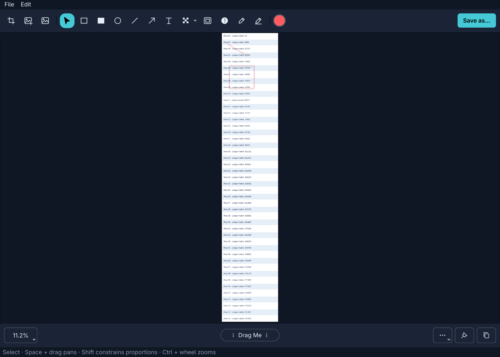

# OmniShot for Omarchy

Screen capture, scrolling screenshots, annotation, and screen recording for Omarchy. OmniShot follows your active Omarchy theme automatically and keeps captures on your machine.

**Early community release — v0.2.0.** Inspired by the CleanShot X workflow, with broad local functionality implemented. Exact feature and UI/UX parity is still being worked on. This is an independent project, with no affiliation with CleanShot.

[User guide](docs/USAGE.md) · [Known limitations](docs/KNOWN_LIMITATIONS.md) · [Roadmap / issues](https://github.com/joshdaws/omnishot/issues) · [Contributing](CONTRIBUTING.md)

## What it does

- Area, window, display, full-desktop, timed, and previous-area screenshots.
- Vertical and horizontal scrolling capture, manually or with Auto-Scroll.
- Corner previews with copy, save, annotate, drag, pin, and history actions.
- Arrows, text, shapes, counters, pencil, smart highlighter, blur, pixelation, and spotlight.
- Crop, resize, rotate, combine images, and add backgrounds. Save editable `.omnishot` projects.
- Local OCR and QR recognition; PNG, JPEG, WebP, and HEIC image exports.
- H.264/GIF recording, pause/resume, audio, camera overlays, and an editable video timeline with cuts and zooms.
- An Omarchy bar widget, configurable shortcuts, and a local CLI/URL API.

No accounts, telemetry, uploads, or cloud syncing. The interface follows Omarchy's palette; there is no separate light/dark switch.

## Compatibility

Developed and tested on **Omarchy 4.0.2 with Hyprland 0.56.2**, including fractional scale 1.6 and mixed-scale displays. This release requires Omarchy's Lua-based Hyprland configuration and shell plugin API. Other Hyprland versions and distributions are not currently supported.

A native capture extension is built against the installed Hyprland headers and checks the running compositor ABI before loading. After upgrading Hyprland, restart your desktop session and rebuild OmniShot. GPU recording requires a working `gpu-screen-recorder` setup. Physical camera/microphone coverage and HDR capture are still open work.

## Install

Use a terminal inside an unlocked Omarchy session. Keep the checkout at the same location after installation.

```sh
git clone https://github.com/joshdaws/omnishot.git
cd omnishot

# Install missing build and runtime dependencies.
omarchy pkg add python python-pip gcc pkgconf wayland wayland-protocols \
  cairo libxkbcommon libglvnd lua54 grim slurp wl-clipboard ffmpeg \
  tesseract tesseract-data-eng tesseract-data-osd gpu-screen-recorder libpulse

bash install.sh
omnishot menu
```

Hyprland and its matching headers must already be installed by Omarchy. Additional OCR languages require the corresponding `tesseract-data-*` packages. Python dependencies are installed into a local `.venv`.

The installer adds user-owned launchers, file associations, a bar widget, and Hyprland bindings/rules. It backs up existing files under `backups/<timestamp>/` and does not edit `/usr/share/omarchy/`. It replaces the default Print, Alt+Print, and Super+Ctrl+Print actions; other capture bindings are listed below. Existing image/video default applications are preserved.

## Capture → annotate

1. Press **Super+Shift+Print** and select the scrolling content.
2. Click **Start Capture**. Scroll manually or choose **Auto-Scroll**.
3. Click **Done**, then click the corner preview to annotate.
4. Draw, crop, or conceal information, then copy/save/drag the result.

If alignment fails, scroll back slightly or slow down. Captures are limited to 120 megapixels. Save a `.omnishot` project to keep editing later. Projects contain the source image; share a flattened PNG/JPEG/WebP when concealing information.



| Shortcut | Action |
|---|---|
| Print | Capture menu |
| Ctrl+Print | Area capture |
| Shift+Print | Focused display |
| Super+Shift+Print | Scrolling capture |
| Alt+Print | Screen recording |
| Super+Ctrl+Print | Capture text |

Super+Print retains Omarchy's color picker. Change shortcuts in Settings. See the [user guide](docs/USAGE.md) for horizontal capture, editor gestures, recording, history, and CLI commands.

## Update and remove

To update, finish any capture/recording, quit OmniShot, then run `git pull --ff-only` and `bash install.sh`. Reopen it with `omnishot menu`. Your history and settings live in `~/.local/share/omnishot` (or `$XDG_DATA_HOME/omnishot`) and are separate from the checkout.

Removal is currently manual; see [the removal guide](docs/REMOVE.md). Do not delete your history folder unless you also intend to delete your captures and editable projects.

## Development status

The latest local suite passes **435 automated tests**. Native Wayland checks cover scrolling → preview → annotation → project reopening, cross-display captures, control exclusion, and image/file dragging. Headed Chromium tests captured 60 vertical rows and 30 horizontal columns at 1.6× with fixed edges intact.

These checks do not establish exact CleanShot parity or exhaustive hardware compatibility. See the [feature ledger](docs/PARITY.md) and [known limitations](docs/KNOWN_LIMITATIONS.md). GitHub issues are the working backlog; reproducible bugs, device reports, and focused pull requests are welcome.

## License

MIT, with bundled third-party notices retained. Nunito is licensed under SIL OFL 1.1; vendored slurp and Wayland protocols retain their own notices. See [LICENSE](LICENSE) and [THIRD_PARTY.md](THIRD_PARTY.md).
